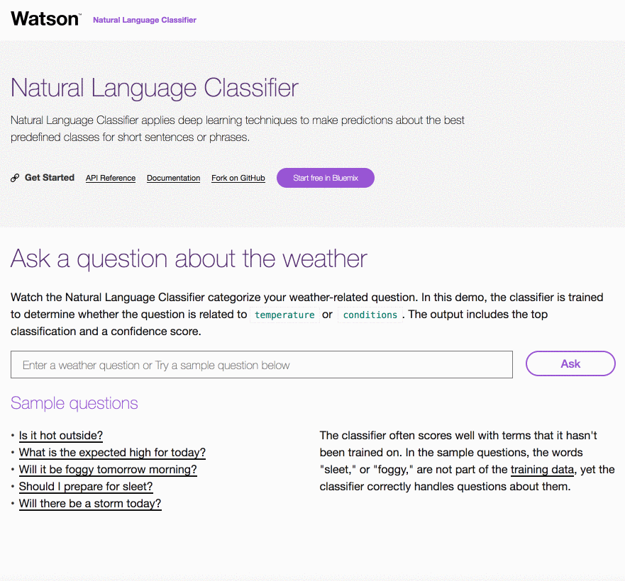

# Natural Language Classifier Demo [](http://travis-ci.org/watson-developer-cloud/natural-language-classifier-nodejs) [](https://codecov.io/gh/watson-developer-cloud/natural-language-classifier-nodejs)


  The IBM Watson&trade; Natural Language Classifier service applies deep learning techniques to make predictions about the best predefined classes for short sentences or phrases. The classes can trigger a corresponding action in an application, such as directing a request to a location or person, or answering a question. After training, the service returns information for texts that it hasn't seen before. The response includes the name of the top classes and confidence values.



## Getting started

1. You need a Bluemix account. If you don't have one, [sign up][sign_up]. Experimental Watson Services are free to use.

2. Download and install the [Cloud-foundry CLI][cloud_foundry] tool if you haven't already.

3. Edit the `manifest.yml` file and change `<application-name>` to something unique. The name you use determines the URL of your application. For example, `<application-name>.mybluemix.net`.

  ```yaml
  applications:
  - services:
    - my-service-instance
    name: <application-name>
    command: npm start
    path: .
    memory: 512M
  ```

4. Connect to Bluemix with the command line tool.

  ```sh
  cf api https://api.ng.bluemix.net
  cf login
  ```

5. Create and retrieve service keys to access the [Natural Language Classifier][nlc_docs] service:

  ```none
  cf create-service natural_language_classifier standard my-nlc-service
  cf create-service-key my-nlc-service myKey
  cf service-key my-nlc-service myKey
  ```

6. The Natural Language Classifier service must be trained before you can successfully use this application. The training data is provided in the file `training/weather_data_train.csv`.  
 Train a classifier by using the following command:

  ```none
  curl -i -u "<username>":"<password>" \
  -F training_data=@training/weather_data_train.csv \
  -F training_metadata="{\"language\":\"en\",\"name\":\"TutorialClassifier\"}" \
  "https://gateway.watsonplatform.net/natural-language-classifier/api/v1/classifiers"
  ```
  Copy `<username>` and `<password>` from step 5

7. Create a `.env` file in the root directory by copying the sample `.env.example` file using the following command:

  ```none
  cp .env.example .env
  ```
  You will update the `.env` with the information you retrieved in steps 5 and 6

  The `.env` file will look something like the following:

  ```none
  NATURAL_LANGUAGE_CLASSIFIER_USERNAME=
  NATURAL_LANGUAGE_CLASSIFIER_PASSWORD=
  CLASSIFIER_ID=
  ```

8. Install the dependencies you application need:

  ```none
  npm install
  ```

9. Start the application locally:

  ```none
  npm start
  ```

10. Point your browser to [http://localhost:3000](http://localhost:3000).

11. **Optional:** Push the application to Bluemix:

  ```none
  cf push
  ```

After completing the steps above, you are ready to test your application. Start a browser and enter the URL of your application.

            <your application name>.mybluemix.net


For more details about developing applications that use Watson Developer Cloud services in Bluemix, see [Getting started with Watson Developer Cloud and Bluemix][getting_started].


## Troubleshooting

* The main source of troubleshooting and recovery information is the Bluemix log. To view the log, run the following command:

  ```sh
  cf logs <application-name> --recent
  ```

* For more details about the service, see the [documentation][nlc_docs] for the Natural Language Classifier.


----

### Directory structure

```none
.
├── app.js                      // express routes
├── config                      // express configuration
│   ├── error-handler.js
│   ├── express.js
│   └── security.js
├── manifest.yml
├── package.json
├── public                      // static resources
├── server.js                   // entry point
├── test                        // unit tests
├── training
│   └── weather_data_train.csv  // training file
└── views                       // react components
```

## License

  This sample code is licensed under Apache 2.0.

## Contributing

  See [CONTRIBUTING](.github/CONTRIBUTING.md).

## Open Source @ IBM
  Find more open source projects on the [IBM Github Page](http://ibm.github.io/)

## Privacy Notice

Sample web applications that include this package may be configured to track deployments to [IBM Bluemix](https://www.bluemix.net/) and other Cloud Foundry platforms. The following information is sent to a [Deployment Tracker](https://github.com/IBM-Bluemix/cf-deployment-tracker-service) service on each deployment:

* Node.js package version
* Node.js repository URL
* Application Name (`application_name`)
* Space ID (`space_id`)
* Application Version (`application_version`)
* Application URIs (`application_uris`)
* Labels of bound services
* Number of instances for each bound service and associated plan information

This data is collected from the `package.json` file in the sample application and the `VCAP_APPLICATION` and `VCAP_SERVICES` environment variables in IBM Bluemix and other Cloud Foundry platforms. This data is used by IBM to track metrics around deployments of sample applications to IBM Bluemix to measure the usefulness of our examples, so that we can continuously improve the content we offer to you. Only deployments of sample applications that include code to ping the Deployment Tracker service will be tracked.

[deploy_track_url]: https://github.com/cloudant-labs/deployment-tracker
[cloud_foundry]: https://github.com/cloudfoundry/cli
[getting_started]: https://console.bluemix.net/docs/services/watson/index.html#about
[nlc_docs]: https://console.bluemix.net/docs/services/natural-language-classifier/getting-started.html
[sign_up]: https://console.bluemix.net/registration/?target=%2Fcatalog%2Fservices%2Fnatural-language-classifier%2F

